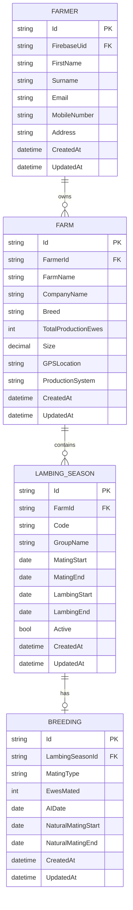
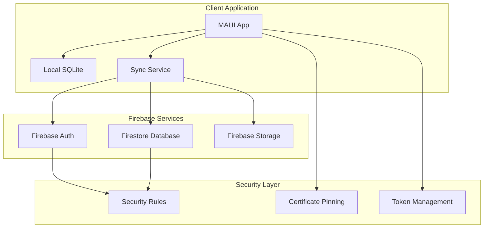
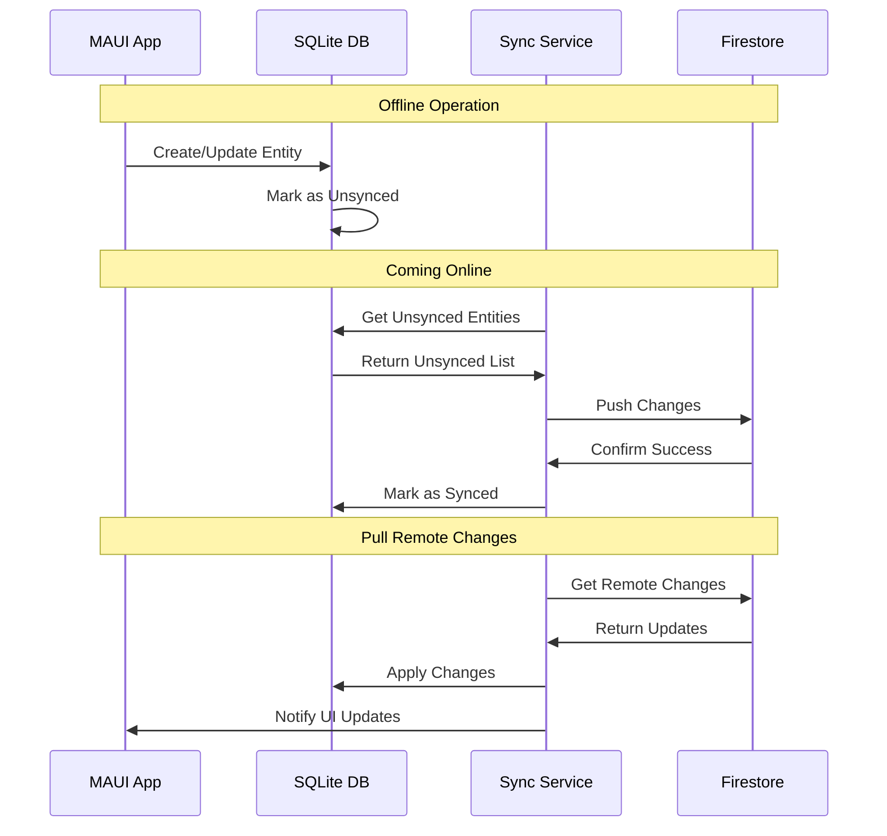

# FlockForge Implementation Roadmap

> **Detailed implementation plan for completing Firebase integration and core business entities**

## 🎯 Executive Summary

Based on the comprehensive architectural review, FlockForge has an excellent foundation with outstanding memory management, clean MVVM architecture, and robust performance monitoring. The critical next phase involves completing the Firebase integration and implementing the core business entities for sheep farm management.

**Current Status:** Architecture Foundation Complete (B+ Rating)  
**Next Phase:** Core Implementation (Estimated 6-8 weeks)  
**Target:** Production-Ready MVP

## 📋 Implementation Phases

### Phase 1: Core Business Entities (Week 1-2)
**Priority:** Critical  
**Dependencies:** None  
**Estimated Effort:** 16-20 hours

#### 1.1 Entity Model Implementation
- [ ] **Farmer Entity** (4 hours)
  - Personal profile with contact information
  - Authentication relationship
  - Multi-farm ownership support
  
- [ ] **Farm Entity** (6 hours)
  - Farm details with GPS coordinates
  - Breed specifications and production systems
  - Contact management (agents, veterinarians, abattoirs)
  
- [ ] **Group/Lambing Season Entity** (4 hours)
  - Seasonal planning with mating/lambing date ranges
  - Active season management
  - Automatic date calculations
  
- [ ] **Production Record Entities** (6 hours)
  - Breeding records with mating events
  - Scanning records with pregnancy confirmation
  - Lambing records with birth outcomes
  - Weaning records with final metrics

#### 1.2 Database Schema Updates
- [ ] **Entity Framework Migrations** (2 hours)
  - Add new entity configurations to `FlockForgeDbContext`
  - Create database migrations
  - Update indexes and relationships
  
- [ ] **Seed Data** (2 hours)
  - Default breed types
  - Production system templates
  - Sample data for development

**Deliverables:**
- Complete entity models with validation
- Updated database schema
- Entity Framework configurations
- Unit tests for entity relationships

### Phase 2: Firebase Integration (Week 3-4)
**Priority:** Critical  
**Dependencies:** Phase 1 complete  
**Estimated Effort:** 20-24 hours

#### 2.1 Firebase SDK Integration
- [ ] **Package Installation** (2 hours)
  - Add Firebase NuGet packages
  - Configure platform-specific settings
  - Update project files for Firebase support
  
- [ ] **Authentication Service** (8 hours)
  - Replace placeholder `FirebaseService` implementation
  - Implement email/password authentication
  - Add Google, Apple, Microsoft SSO
  - Integrate with existing `FlockForgeUser` model
  
- [ ] **Firestore Integration** (10 hours)
  - Document-based data operations
  - Offline persistence configuration
  - Security rules implementation
  - Query optimization for sheep farm data

#### 2.2 Security Implementation
- [ ] **Certificate Pinning** (2 hours)
  - Complete implementation in `MauiProgram.cs`
  - Add certificate validation logic
  
- [ ] **Firestore Security Rules** (2 hours)
  - User data isolation
  - Farm-based access control
  - Email verification requirements

**Deliverables:**
- Fully functional Firebase authentication
- Firestore integration with offline support
- Security rules and certificate pinning
- Authentication flow testing

### Phase 3: Offline Sync Implementation (Week 5)
**Priority:** High  
**Dependencies:** Phase 2 complete  
**Estimated Effort:** 12-16 hours

#### 3.1 Sync Service Completion
- [ ] **Background Sync Logic** (8 hours)
  - Replace placeholder implementations
  - Implement conflict resolution (last-write-wins)
  - Add retry policies for failed operations
  - Queue management for offline changes
  
- [ ] **Data Synchronization** (6 hours)
  - Local-to-remote sync for all entities
  - Remote-to-local sync with change detection
  - Incremental sync optimization
  
- [ ] **Sync Status UI** (2 hours)
  - Sync indicators in navigation
  - Progress reporting for large syncs
  - Error handling and user feedback

**Deliverables:**
- Complete offline-first synchronization
- Conflict resolution implementation
- Sync status monitoring
- Performance optimization

### Phase 4: ViewModels and Business Logic (Week 6)
**Priority:** High  
**Dependencies:** Phase 3 complete  
**Estimated Effort:** 16-20 hours

#### 4.1 Core ViewModels
- [ ] **Farmer Profile ViewModel** (4 hours)
  - Profile management with validation
  - Photo upload integration
  - Auto-save functionality
  
- [ ] **Farm Profile ViewModel** (6 hours)
  - Multi-farm management
  - GPS integration
  - Contact management
  
- [ ] **Production ViewModels** (10 hours)
  - Breeding cycle management
  - Scanning results with calculations
  - Lambing event tracking
  - Weaning record management

#### 4.2 Business Logic Implementation
- [ ] **Calculation Engine** (4 hours)
  - Automatic gestation calculations
  - Performance ratios and percentages
  - Validation rules and constraints
  
- [ ] **Data Validation** (2 hours)
  - Cross-entity validation
  - Business rule enforcement
  - Error messaging

**Deliverables:**
- Complete ViewModels for all entities
- Business logic with calculations
- Data validation framework
- MVVM binding implementation

### Phase 5: UI Implementation and Testing (Week 7-8)
**Priority:** Medium  
**Dependencies:** Phase 4 complete  
**Estimated Effort:** 20-24 hours

#### 5.1 Page Implementation
- [ ] **Farmer Profile Page** (4 hours)
- [ ] **Farm Profile Page** (6 hours)
- [ ] **Groups/Lambing Season Page** (4 hours)
- [ ] **Production Pages** (10 hours)
  - Breeding page with conditional fields
  - Scanning page with real-time calculations
  - Lambing page with mortality tracking
  - Weaning page with performance metrics

#### 5.2 Testing and Optimization
- [ ] **Unit Testing** (8 hours)
  - Business logic tests
  - ViewModel tests
  - Service integration tests
  
- [ ] **Performance Testing** (4 hours)
  - Memory usage optimization
  - Sync performance validation
  - UI responsiveness testing
  
- [ ] **Field Testing** (8 hours)
  - Offline functionality validation
  - Real-world usage scenarios
  - Performance under load

**Deliverables:**
- Complete UI implementation
- Comprehensive test suite
- Performance optimization
- Field-tested application

## 🛠️ Technical Implementation Details

### Database Schema Design



### Firebase Integration Architecture



### Sync Strategy Implementation



## 📊 Resource Requirements

### Development Team
- **Lead Developer:** Full-stack .NET/MAUI experience (40 hours/week)
- **Firebase Specialist:** Authentication and Firestore expertise (20 hours/week)
- **UI/UX Developer:** XAML and mobile UI experience (20 hours/week)
- **QA Engineer:** Mobile testing and automation (16 hours/week)

### Infrastructure
- **Firebase Project:** Blaze plan for production usage
- **Development Devices:** iOS and Android test devices
- **CI/CD Pipeline:** Azure DevOps or GitHub Actions
- **Code Repository:** Git with branching strategy

### Third-Party Dependencies
```xml
<!-- Additional NuGet packages needed -->
<PackageReference Include="FirebaseAuthentication.net" Version="4.1.0" />
<PackageReference Include="FirebaseDatabase.net" Version="4.2.0" />
<PackageReference Include="Plugin.FirebasePushNotification" Version="3.0.11" />
<PackageReference Include="Polly" Version="8.2.0" />
<PackageReference Include="Polly.Extensions.Http" Version="3.0.0" />
```

## 🎯 Success Metrics

### Phase Completion Criteria
- [ ] **Phase 1:** All entities created with passing unit tests
- [ ] **Phase 2:** Firebase authentication working with real users
- [ ] **Phase 3:** Offline sync tested with 1000+ records
- [ ] **Phase 4:** All ViewModels implemented with business logic
- [ ] **Phase 5:** Complete app tested on multiple devices

### Performance Targets
- **App Startup:** < 3 seconds on mid-range devices
- **Sync Performance:** < 30 seconds for 500 records
- **Memory Usage:** < 150MB during normal operation
- **Battery Impact:** < 5% drain per hour of active use
- **Offline Capability:** 30+ days without connectivity

### Quality Gates
- **Code Coverage:** > 80% for business logic
- **Performance Tests:** All scenarios under target times
- **Security Audit:** No critical vulnerabilities
- **Accessibility:** WCAG 2.1 AA compliance
- **Platform Testing:** iOS 15+, Android API 21+

## 🚨 Risk Mitigation

### Technical Risks
1. **Firebase Quota Limits**
   - *Risk:* Exceeding free tier limits
   - *Mitigation:* Monitor usage, implement caching
   
2. **Sync Conflicts**
   - *Risk:* Data corruption during concurrent edits
   - *Mitigation:* Implement proper conflict resolution
   
3. **Performance Degradation**
   - *Risk:* App becomes slow with large datasets
   - *Mitigation:* Implement pagination and lazy loading

### Timeline Risks
1. **Firebase Integration Complexity**
   - *Risk:* Authentication flows more complex than expected
   - *Mitigation:* Allocate buffer time, consider Firebase experts
   
2. **Entity Relationship Complexity**
   - *Risk:* Business logic more complex than anticipated
   - *Mitigation:* Iterative development with stakeholder feedback

## 📅 Detailed Timeline

### Week 1: Foundation Entities
- **Monday-Tuesday:** Farmer and Farm entities
- **Wednesday-Thursday:** Group/Lambing Season entities
- **Friday:** Production record entities and testing

### Week 2: Database Integration
- **Monday-Tuesday:** Entity Framework configurations
- **Wednesday-Thursday:** Database migrations and relationships
- **Friday:** Seed data and validation testing

### Week 3: Firebase Authentication
- **Monday-Tuesday:** Firebase SDK integration
- **Wednesday-Thursday:** Authentication service implementation
- **Friday:** SSO providers and testing

### Week 4: Firestore Integration
- **Monday-Tuesday:** Document operations and offline persistence
- **Wednesday-Thursday:** Security rules and optimization
- **Friday:** Integration testing and performance validation

### Week 5: Sync Implementation
- **Monday-Tuesday:** Background sync service completion
- **Wednesday-Thursday:** Conflict resolution and retry policies
- **Friday:** Sync status UI and testing

### Week 6: ViewModels and Business Logic
- **Monday-Tuesday:** Core ViewModels implementation
- **Wednesday-Thursday:** Business logic and calculations
- **Friday:** Data validation and error handling

### Week 7: UI Implementation
- **Monday-Tuesday:** Farmer and Farm profile pages
- **Wednesday-Thursday:** Groups and production pages
- **Friday:** UI testing and refinement

### Week 8: Testing and Optimization
- **Monday-Tuesday:** Unit testing and performance optimization
- **Wednesday-Thursday:** Field testing and bug fixes
- **Friday:** Final validation and deployment preparation

## 🎉 Deliverables Summary

### Phase 1 Deliverables
- Complete entity models with relationships
- Database schema with migrations
- Unit tests for all entities
- Documentation for data model

### Phase 2 Deliverables
- Functional Firebase authentication
- Firestore integration with offline support
- Security implementation
- Authentication flow documentation

### Phase 3 Deliverables
- Complete offline synchronization
- Conflict resolution implementation
- Sync monitoring and reporting
- Performance optimization

### Phase 4 Deliverables
- All ViewModels with business logic
- Calculation engine implementation
- Data validation framework
- MVVM binding completion

### Phase 5 Deliverables
- Complete UI implementation
- Comprehensive test suite
- Performance validation
- Production-ready application

## 🔄 Continuous Integration

### Development Workflow
1. **Feature Branch Development**
2. **Pull Request Review**
3. **Automated Testing**
4. **Performance Validation**
5. **Merge to Main**
6. **Deployment Pipeline**

### Quality Assurance
- **Daily Builds:** Automated build and test execution
- **Weekly Performance Tests:** Memory and sync performance validation
- **Bi-weekly Security Scans:** Vulnerability assessment
- **Monthly Penetration Testing:** Security validation

This roadmap provides a comprehensive path from the current excellent architectural foundation to a production-ready sheep farm management application optimized for rural environments with intermittent connectivity.