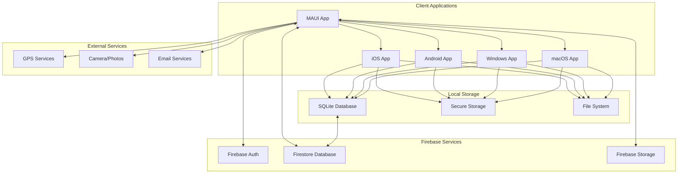
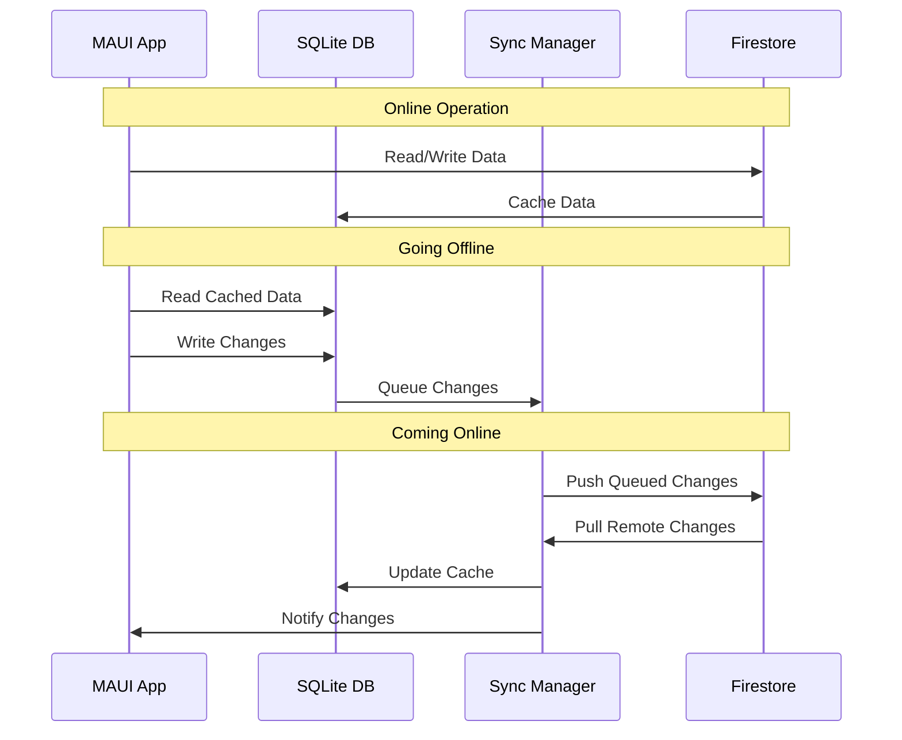

# FlockForge - Sheep Farm Management System

> **Comprehensive livestock management built specifically for sheep farmers**

FlockForge is a cross-platform mobile application designed for sheep farmers managing breeding, lambing, and production cycles. Built with offline-first functionality for rural environments with intermittent connectivity.


## 🎯 Project Overview

### Problem Statement
Sheep farmers need specialized software for managing complex breeding cycles, lambing seasons, and production metrics. Existing solutions focus primarily on cattle management and lack sheep-specific features and offline capabilities essential for rural farming operations.

### Solution
FlockForge provides a comprehensive, offline-first sheep management system with:
- **Breeding cycle management** with automatic gestation calculations
- **Lambing season organization** and tracking
- **Production metrics** and performance analysis
- **Field-rugged interface** designed for gloved hands and outdoor conditions
- **Multi-platform support** for iOS, Android, Windows, and macOS

### Target Users
- **Primary:** Sheep farmers managing breeding operations
- **Secondary:** Agricultural consultants and veterinarians
- **Devices:** 90% use Apple (iOS) and Samsung (Android) devices
- **Environment:** Rural areas with poor network connectivity

## 🏗️ System Architecture

### Technology Stack

#### Frontend
- **.NET 9.0** - Application framework
- **MAUI** - Cross-platform UI framework
- **C#** - Programming language
- **XAML** - UI markup language
- **CommunityToolkit.Mvvm** - MVVM framework

#### Backend
- **Firebase Authentication** - User management with email/password + SSO
- **Firestore** - NoSQL cloud database with offline support
- **Firebase Storage** - File and photo storage
- **Firebase Functions** - Serverless functions (if needed)

#### Local Storage
- **SQLite-net-pcl** - Local database for offline functionality
- **Secure Storage** - Platform keychain/keystore integration

#### Development Environment
- **VS Code/Cursor** - Primary IDE with C# Dev Kit extension
- **Xcode** - Required for iOS development
- **Android Studio** - Android SDK and emulators

### Architecture Diagram



## 📊 Data Model

### Core Entities

#### Farmer Profile
- Personal details and contact information
- Authentication and account management

#### Farm Profile (Multi-farm support)
- Farm details: name, size, location, GPS coordinates
- Breed specifications and production systems
- Preferred contacts (agents, veterinarians, abattoirs)

#### Groups/Lambing Seasons
- Breeding group organization
- Seasonal planning with mating/lambing date ranges
- Active season management

#### Production Records
1. **Breeding Records** - Mating events and breeding management
2. **Scanning Records** - Pregnancy confirmation and fetus counts
3. **Lambing Records** - Birth outcomes and mortality tracking
4. **Weaning Records** - Final production metrics and performance

### Data Relationships
```
Farmer → Farms → Lambing Seasons → Breeding → Scanning → Lambing → Weaning
```

### Entity Relationship Diagram

```mermaid
erDiagram
    FARMER {
        string Id PK
        string FirstName
        string Surname
        string Email
        string MobileNumber
        string Address
        string City
        string Province
        string ZipCode
        string SubRegion
        datetime CreatedAt
        datetime UpdatedAt
    }
    
    FARM {
        string Id PK
        string FarmerId FK
        string FarmName
        string CompanyName
        string Breed
        int TotalProductionEwes
        decimal Size
        string SizeUnit
        string Address
        string City
        string Province
        string GPSLocation
        string ProductionSystem
        string PreferredAgent
        string PreferredAbattoir
        string PreferredVeterinary
        string CoOp
        datetime CreatedAt
        datetime UpdatedAt
    }
    
    LAMBING_SEASON {
        string Id PK
        string FarmId FK
        string Code
        string GroupName
        date MatingStart
        date MatingEnd
        date LambingStart
        date LambingEnd
        bool Active
        datetime CreatedAt
        datetime UpdatedAt
    }
    
    BREEDING {
        string Id PK
        string LambingSeasonId FK
        string MatingType
        int EwesMated
        date AIDate
        date NaturalMatingStart
        date NaturalMatingEnd
        int Days
        bool UseFollowUpRams
        date FollowUpRamsIn
        date FollowUpRamsOut
        int DaysIn
        date DateForYearCalculation
        int Year
        datetime CreatedAt
        datetime UpdatedAt
    }
    
    SCANNING {
        string Id PK
        string BreedingId FK
        int EwesMated
        int EwesScanned
        int EwesPregnant
        int EwesNotPregnant
        decimal ConceptionRatio
        int ScannedFetuses
        int EwesWithSingles
        int EwesWithTwins
        int EwesWithTriplets
        decimal ExpectedLambingPercentPregnant
        decimal ExpectedLambingPercentMated
        datetime CreatedAt
        datetime UpdatedAt
    }
    
    LAMBING {
        string Id PK
        string ScanningId FK
        int EwesLambed
        int LambsBorn
        int LambsDead
        int LambsAfterMortality
        decimal AverageBirthWeight
        decimal LambingPercentMated
        decimal LambingPercentLambed
        decimal LambingMortalityPercent
        decimal EwesLambedFromMating
        decimal DryEwesPercentMated
        decimal DryEwesPercentLambed
        decimal LambingMortalityPercentLambed
        datetime CreatedAt
        datetime UpdatedAt
    }
    
    WEANING {
        string Id PK
        string LambingId FK
        int LambsWeaned
        int RamLambs
        int EweLambs
        int LambsBorn
        int RamsWeaned
        decimal EwesWeanedPercent
        decimal AverageWeanWeight
        int BreedingEwesDeadFromScan
        decimal LambsWeanedPercentMated
        decimal LambsWeanedPercentLambed
        decimal WeaningMortality
        int OtherMortalities
        datetime CreatedAt
        datetime UpdatedAt
    }
    
    FARMER ||--o{ FARM : owns
    FARM ||--o{ LAMBING_SEASON : contains
    LAMBING_SEASON ||--o| BREEDING : has
    BREEDING ||--o| SCANNING : has
    SCANNING ||--o| LAMBING : has
    LAMBING ||--o| WEANING : has
```



## 🎨 Design System

### Design Philosophy: "Rugged Minimalism"
- **High contrast** - readable in bright sunlight
- **Large touch targets** - workable with gloves (minimum 44pt)
- **Simple navigation** - minimal cognitive load
- **Clear typography** - legible from arm's length
- **Minimal animations** - preserve battery, reduce distractions

### Color Palette
```css
/* Primary Colors */
--primary-green: #2E7D32;    /* Forest green - agricultural theme */
--primary-blue: #1976D2;     /* Strong blue - action elements */
--accent-orange: #F57C00;    /* Orange - warnings and alerts */

/* Neutral Colors */
--text-primary: #212121;     /* Near black */
--text-secondary: #757575;   /* Gray */
--surface: #FAFAFA;          /* Off white */
--background: #FFFFFF;       /* Pure white */
```

### Typography Scale
- **Header Text:** 24px, Bold
- **Body Text:** 16px, Regular, 1.4 line height
- **Field Labels:** 14px, Medium
- **All fonts:** High contrast for outdoor readability

### Component Patterns
- **Card-based layouts** for grouping information
- **Bottom tab navigation** for mobile
- **Modal forms** for data entry
- **Large, touch-friendly buttons** (48px minimum height)
- **Clear status indicators** for sync and validation

## 🔧 Development Setup

### Prerequisites
- **.NET 9.0 SDK** or later
- **Visual Studio Code** with C# Dev Kit extension
- **Xcode** (for iOS development)
- **Android Studio** (for Android development)
- **Firebase project** with Authentication and Firestore enabled

### Installation Steps

1. **Clone the repository**
   ```bash
   git clone https://github.com/your-username/flockforge.git
   cd flockforge
   ```

2. **Install .NET MAUI workload**
   ```bash
   dotnet workload install maui
   ```

3. **Restore dependencies**
   ```bash
   dotnet restore
   ```

4. **Set up Firebase configuration**
   - Add `google-services.json` (Android) to `Platforms/Android/`
   - Add `GoogleService-Info.plist` (iOS) to `Platforms/iOS/`

5. **Build the project**
   ```bash
   dotnet build
   ```

6. **Run on specific platform**
   ```bash
   # macOS
   dotnet run -f net9.0-maccatalyst
   
   # iOS Simulator
   dotnet run -f net9.0-ios
   
   # Android
   dotnet run -f net9.0-android
   ```

### Development Environment Configuration

#### VS Code Extensions
- **C# Dev Kit** - Essential for MAUI development
- **C#** - Base language support
- **XAML** - XAML syntax highlighting

#### Environment Variables
```bash
# Add to ~/.zshrc or ~/.bash_profile
export ANDROID_HOME=$HOME/Library/Android/sdk
export PATH=$PATH:$ANDROID_HOME/cmdline-tools/latest/bin
export PATH=$PATH:$ANDROID_HOME/platform-tools
export PATH=$PATH:$ANDROID_HOME/emulator
export JAVA_HOME=$(/usr/libexec/java_home)
```

## 🔒 Security & Authentication

### Authentication Methods
- **Email/Password** with required email verification
- **Google SSO** - High farmer adoption
- **Apple SSO** - iOS App Store requirement
- **Microsoft SSO** - Enterprise farm integration

### Security Features
- **Data encryption** at rest (SQLite) and in transit (HTTPS/TLS)
- **User data isolation** via Firestore security rules
- **Email verification** required for account access
- **Session management** with automatic logout
- **GDPR compliance** - data export and deletion

### Firestore Security Rules
```javascript
rules_version = '2';
service cloud.firestore {
  match /databases/{database}/documents {
    // Users can only access their own data
    match /farmers/{farmerId} {
      allow read, write: if request.auth != null 
        && request.auth.uid == farmerId 
        && request.auth.token.email_verified == true;
    }
    
    // Farms belong to authenticated farmers
    match /farms/{farmId} {
      allow read, write: if request.auth != null
        && resource.data.farmerId == request.auth.uid;
    }
  }
}
```

## 📱 Offline-First Architecture

### Strategy
1. **Local-First Operations** - All actions work against SQLite database
2. **Background Sync** - Changes sync to Firebase when connectivity available
3. **Conflict Resolution** - Last-write-wins with timestamp comparison
4. **Optimistic Updates** - UI updates immediately, syncs in background
5. **Queue Management** - Failed operations retry automatically

### Sync Flow


## 📋 Features & Functionality

### Core Features

#### Farmer & Farm Management
- **Personal Profile** - Contact details and account settings
- **Multi-Farm Support** - Manage multiple farm properties
- **GPS Integration** - Location tracking for farms and fields
- **Contact Management** - Preferred agents, vets, and service providers

#### Breeding Cycle Management
- **Lambing Season Planning** - Group organization and date planning
- **Breeding Records** - AI and natural mating tracking
- **Automatic Calculations** - Gestation periods (147-152 days for sheep)
- **Follow-up Ram Management** - Secondary breeding tracking

#### Production Tracking
- **Scanning Records** - Pregnancy confirmation and fetus counts
- **Lambing Events** - Birth outcomes and mortality tracking
- **Weaning Records** - Final production metrics
- **Performance Analytics** - Breeding efficiency and ratios

#### Reporting & Analytics
- **Real-time Calculations** - Automatic percentage and ratio updates
- **Performance Metrics** - Conception rates, lambing percentages
- **Historical Tracking** - Multi-season comparisons
- **Export Capabilities** - Data export for external analysis

### Business Logic

#### Automatic Calculations
- **Gestation Period** - Lambing dates calculated from mating dates
- **Conception Ratio** - Ewes pregnant / Ewes mated × 100
- **Lambing Percentage** - Lambs born / Ewes mated × 100
- **Mortality Rates** - Various mortality calculations across stages
- **Performance Ratios** - Comprehensive breeding efficiency metrics

#### Validation Rules
- **Date Logic** - End dates must be after start dates
- **Capacity Constraints** - Ewes mated ≤ total production ewes
- **Mathematical Consistency** - Totals must equal component sums
- **Cross-stage Integrity** - Data flows logically between stages

## 🚀 Deployment

### Build Configuration

#### Release Build
```bash
# iOS
dotnet publish -f net9.0-ios -c Release

# Android
dotnet publish -f net9.0-android -c Release

# Windows
dotnet publish -f net9.0-windows10.0.19041.0 -c Release
```

#### App Store Requirements
- **iOS App Store** - Apple Developer account ($99/year)
- **Google Play Store** - Google Developer account ($25 one-time)
- **App Store assets** - Screenshots, descriptions, privacy policy

### Firebase Configuration

#### Production Environment
```json
{
  "project_info": {
    "project_number": "your-project-number",
    "project_id": "flockforge-prod",
    "storage_bucket": "flockforge-prod.appspot.com"
  }
}
```

#### Environment Variables
```bash
# Firebase configuration
FIREBASE_PROJECT_ID=flockforge-prod
FIREBASE_API_KEY=your-api-key
FIREBASE_AUTH_DOMAIN=flockforge-prod.firebaseapp.com
```

## 🧪 Testing Strategy

### Unit Testing
- **Business Logic** - Breeding calculations and validations
- **Data Models** - Entity relationships and constraints
- **Services** - Firebase integration and offline sync

### Integration Testing
- **Database Operations** - SQLite and Firestore integration
- **Authentication Flow** - Login, registration, verification
- **Sync Operations** - Offline/online data synchronization

### User Acceptance Testing
- **Field Testing** - Real farm environment validation
- **Device Testing** - Various iOS and Android devices
- **Connectivity Testing** - Offline/online transition scenarios

## 📈 Performance Considerations

### Client Performance
- **Lazy Loading** - Load data only when needed
- **Virtual Lists** - Handle large datasets efficiently
- **Image Caching** - Cache photos locally
- **Background Tasks** - Sync operations in background threads
- **Memory Management** - Proper resource disposal

### Database Performance
- **Indexing Strategy** - Index frequently queried fields
- **Query Optimization** - Efficient Firestore queries
- **Pagination** - Load data in manageable chunks
- **Caching Strategy** - Multi-level caching (memory, disk, remote)

## 📊 Analytics & Monitoring

### Application Monitoring
- **Crash Reporting** - Firebase Crashlytics
- **Performance Monitoring** - Firebase Performance
- **User Analytics** - Firebase Analytics

### Business Intelligence
- **Feature Usage** - Track feature adoption
- **User Engagement** - Session duration and frequency
- **Data Quality** - Monitor data entry patterns
- **System Health** - Error rates and performance metrics

## 🛣️ Roadmap

### Phase 1: Foundation (Weeks 1-2)
- [x] Project setup and Firebase configuration
- [x] Authentication system implementation
- [x] Basic navigation structure
- [ ] Farmer Profile and Farm Profile pages

### Phase 2: Core Functionality (Weeks 3-4)
- [ ] Groups/Lambing Season management
- [ ] Breeding record system with calculations
- [ ] Basic offline capability implementation

### Phase 3: Production Tracking (Weeks 5-6)
- [ ] Scanning record functionality
- [ ] Lambing event tracking
- [ ] Weaning record management
- [ ] Advanced calculations and validations

### Phase 4: Polish & Launch (Weeks 7-8)
- [ ] Offline sync refinement
- [ ] UI/UX improvements for field use
- [ ] Performance optimization
- [ ] App store preparation and submission

### Future Enhancements
- [ ] Photo integration for animal identification
- [ ] Weather integration and alerts
- [ ] Veterinary integration and scheduling
- [ ] Cooperative and group farm management
- [ ] Advanced reporting and benchmarking
- [ ] Integration with agricultural databases

## 🤝 Contributing

### Development Workflow
1. Fork the repository
2. Create a feature branch (`git checkout -b feature/amazing-feature`)
3. Commit your changes (`git commit -m 'Add amazing feature'`)
4. Push to the branch (`git push origin feature/amazing-feature`)
5. Open a Pull Request

### Code Standards
- **C# Conventions** - Follow Microsoft C# coding standards
- **XAML Guidelines** - Consistent naming and structure
- **Documentation** - XML documentation for public APIs
- **Testing** - Unit tests for business logic

## 📄 License

This project is proprietary software. All rights reserved.

## 📞 Support

For support and questions:
- **Email** - support@flockforge.com
- **Documentation** - [Wiki](https://github.com/your-username/flockforge/wiki)
- **Issues** - [GitHub Issues](https://github.com/your-username/flockforge/issues)

## Assets (fonts/images)
PRs are text-only. To use brand fonts locally or in CI:

```bash
# macOS/Linux
bash scripts/fetch_assets.sh
# Windows
powershell -ExecutionPolicy Bypass -File scripts/fetch_assets.ps1
```

After fetching, optionally enable the Inter FontFamily setters in Resources/Styles/GloveFirst.xaml.
Builds succeed without fonts by falling back to system fonts.

---

**FlockForge** - Empowering sheep farmers with intelligent livestock management.